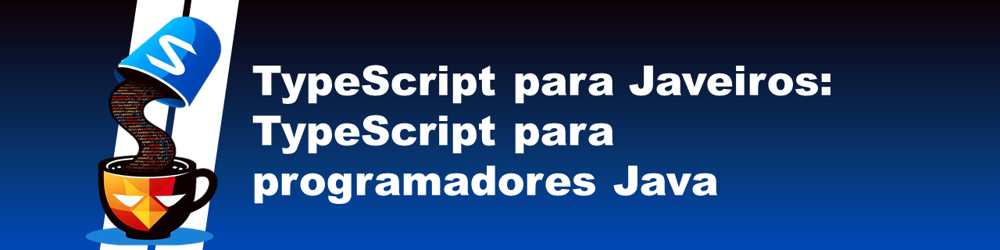

Este artigo explora como programadores familiarizados com Java podem se beneficiar ao aprender TypeScript. Discutimos a importância de entender JavaScript para dominar TypeScript e como a Programação Orientada a Objetos (POO) é implementada no TypeScript com exemplos práticos. Se você está começando sua jornada no mundo da programação ou quer expandir seus conhecimentos, este guia é para você!

## Tópicos Abordados
- O que é Java e TypeScript
- Como o TypeScript agrega para programadores Java
- A importância de entender JavaScript para aprender TypeScript
- Programação Orientada a Objetos (POO) em TypeScript com exemplos de código

## Vamos nos conectar!
Não deixe de me seguir nas redes sociais para ficar por dentro de mais dicas, tutoriais e novidades no mundo da programação!
[Linkedin](https://www.linkedin.com/in/pablynne-caldeira/)